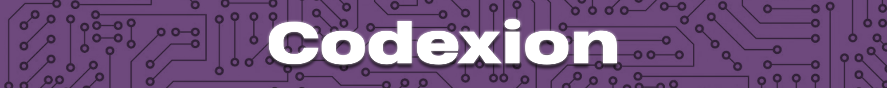

*This project has been created as part of the 42 curriculum by gviola-l.*



## Table of Contents
- [Description](#description)
- [Instructions](#instructions)
- [Command-line arguments](#command-line-arguments)
- [Logging format](#logging-format)
- [Resources](#resources)

---

## `🔍` Description

**Codexion** is a concurrency simulation written in C, inspired by the classic **Dining Philosophers problem**. In this scenario, multiple "coder" threads compete for a limited number of USB dongles to perform compilation tasks.

This implementation illustrates the philosopher theorem in practice: how multiple concurrent actors can safely share limited resources without deadlocks or starvation, while respecting strict timing constraints.

---

## `🚀` Instructions

Build with the provided Makefile. The project compiles with -Wall -Wextra -Werror and links pthread.

```bash
# from project root
make

# run the program (example)
./codexion 4 1500 200 200 200 3 100 fifo
```

---

## `⚙️` Command-line arguments

All arguments are mandatory and must be positive integers except `scheduler` which must be `fifo` or `edf`.

1. number_of_coders -> number of coders
2. time_to_burnout (ms) -> deadline: if a coder does not start compiling before this window since their last compile or simulation start, they burn out
3. time_to_compile (ms)
4. time_to_debug (ms)
5. time_to_refactor (ms)
6. number_of_compiles_required -> simulation ends when every coder reached this compile count
7. dongle_cooldown (ms) -> after a dongle is released it is unavailable for this cooldown
8. scheduler -> `fifo` (First In, First Out) or `edf` (Earliest Deadline First)

Example:

```bash
./codexion 4 1500 200 200 200 5 100 edf
```

---

## `📝` Logging format

Every state change is printed on its own line with a timestamp in milliseconds and the coder id. 

e.g:
```
0 1 has taken a dongle
1 1 has taken a dongle
1 1 is compiling
201 1 is debugging
401 1 is refactoring
1204 3 burned out
```

---

## `📁` Resources

- [Dining philosophers problem](https://en.wikipedia.org/wiki/Dining_philosophers_problem)
- [POSIX threads documentation](https://www.cs.cmu.edu/afs/cs/academic/class/15492-f07/www/pthreads.html)

### AI usage

- Identifying edge-case failures.
- Drafting and polishing this README.

---

## `🛡️` Blocking cases handled

### Deadlock prevention

A deadlock requires all four **Coffman conditions** to hold simultaneously:

| # | Condition         | Meaning                                                          |
|---|-------------------|------------------------------------------------------------------|
| 1 | Mutual exclusion  | A resource can only be held by one thread at a time              |
| 2 | Hold and wait     | A thread holds a resource while waiting for another              |
| 3 | No preemption     | Resources cannot be forcibly taken from a thread                 |
| 4 | Circular wait     | A cycle of threads exists, each waiting on the next              |

Here we break **circular wait**: dongles are always acquired in a fixed global order (lowest index first, see `src/dongles/dongle_order.c`), so no cycle of waits can form.

### Other concurrency hazards

- **Starvation prevention** — each request records an `arrival_order` and a `deadline`; the scheduler (FIFO or EDF) services coders deterministically so none is indefinitely bypassed.
- **Cooldown handling** — after release, each dongle enforces a configurable `dongle_cooldown` via `last_release_ms` before it can be re-acquired.
- **Burnout detection** — a dedicated monitor thread periodically reads each coder's `last_compile_ms` and triggers a clean shutdown if `time_to_burnout` is exceeded.
- **Log serialization** — all output is serialized under `log_mutex`, preventing interleaved lines and inconsistent timestamps.

---

## `🔧` Thread synchronization mechanisms

- **`pthread_mutex_t`** — per-object mutexes protect all shared fields:
  - `coder->mutex` guards `last_compile_ms` and `compiles_done`; the monitor locks this same mutex when reading, preventing torn reads
  - `dongle->mutex` guards `available`, `last_release_ms`, and the `wait_queue`
  - `log_mutex`, `simulation_mutex`, `counter_mutex` protect logging, the `running` flag, and the global request counter respectively
- **`pthread_cond_t`** — coders enqueue a request then block on `dongle->cond`; on release, `pthread_cond_broadcast` wakes all waiters so the scheduler picks the next owner — no busy-waiting
- **Wait queue** — each dongle holds a queue of `{coder_id, deadline, arrival_order}` records consulted under `dongle->mutex`, making scheduling decisions race-free
- **Shutdown coordination** — the monitor sets `running = false` under `simulation_mutex` then calls `wake_all()` (broadcasts every dongle's cond), so blocked coders wake, re-check `is_running()`, and exit cleanly